### AI

#### 前沿领域

LLM/Agent/多模态/MLOps方向

1. 核心工具链
   - **LLM框架**: **LangChain** 或 **LlamaIndex** (二选一，LangChain生态更全，LlamaIndex专注RAG)。CrewAI
   - **文本嵌入模型**: 学习使用OpenAI `text-embedding-3-small`或开源模型（如Hugging Face上的Sentence Transformers）。
   - **向量数据库**: 掌握至少一个，如 **ChromaDB** (本地易用) 或 **Pinecone** (云端强大)。
2. **高级技巧**: 学习如何优化切分策略、进行多轮检索、重排序等。


````
Claude Code Templates
 https://github.com/davila7/claude-code-templates
 https://www.aitmpl.com/agents
 
PandaWiki - 开源的在线 AI 知识库 https://pandawiki.docs.baizhi.cloud/
 
简单几行代码 LangChain 帮我们把 split、embedding、入库全部都做了，再看一下 TiDB Vector 中生成的表结构：

```sql
CREATE TABLE `semantic_embeddings` (
`id` varchar(36) NOT NULL,
`embedding` vector<float>(1536) NOT NULL COMMENT 'hnsw(distance=cosine)',
`document` text DEFAULT NULL,
`meta` json DEFAULT NULL,
`create_time` datetime DEFAULT CURRENT_TIMESTAMP,
`update_time` datetime DEFAULT CURRENT_TIMESTAMP ON UPDATE CURRENT_TIMESTAMP,
PRIMARY KEY (`id`) /*T![clustered_index] CLUSTERED */
) ENGINE=InnoDB DEFAULT CHARSET=utf8mb4 COLLATE=utf8mb4_bin
```

这里做 chunk 用最简单粗暴的形式，每页文档为一个 chunk，chunk 的文本内容存入 `document`字段，向量化后的内容存入

````

#### 名词

就构成了 RAG 的灵魂：检索（Retrieval）、增强（Augmented）、生成（Generation）

Prompt  ReAct (Reason+Act):AI智能体


#### RAG

RAG 简介 https://github.com/datawhalechina/all-in-rag/blob/main/docs/chapter1/01_RAG_intro.md

一文彻底搞懂大模型 - RAG（检索、增强、生成） https://blog.csdn.net/a2875254060/article/details/142468037

RAG企业实战：从原理到落地，构建企业智能知识库 https://www.woshipm.com/ai/6323870.html

最全梳理：一文搞懂RAG技术的5种范式！ https://segmentfault.com/a/1190000046138023


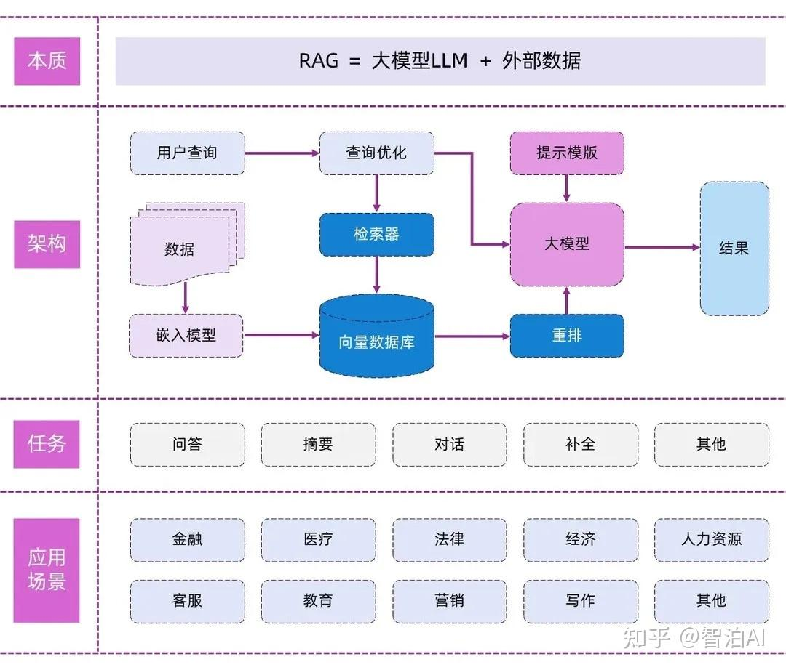

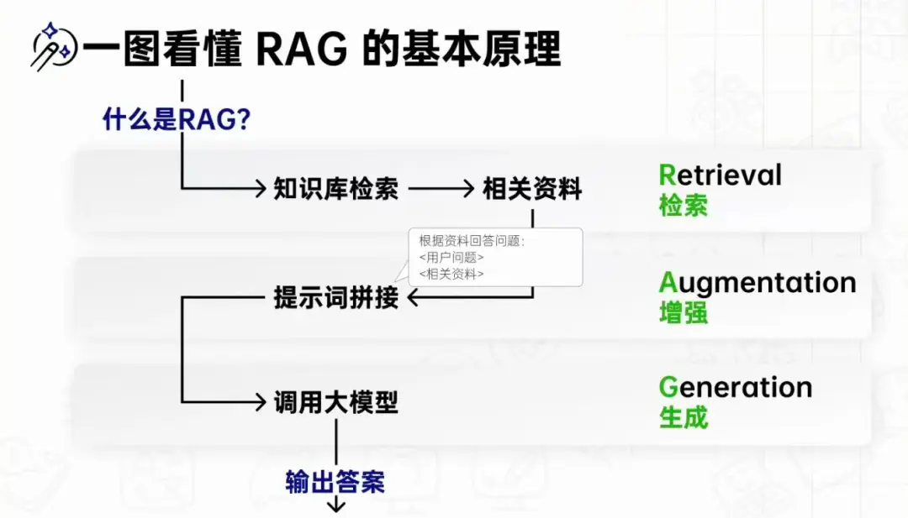

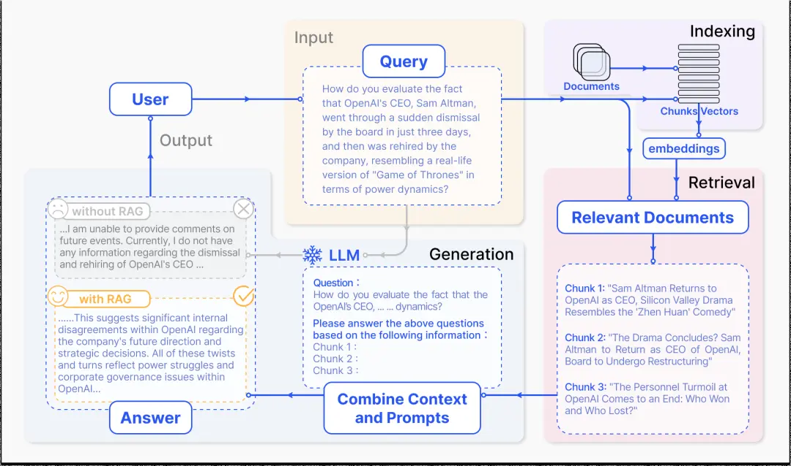

#### SOP

标准化操作程序（Standard Operating Procedure, SOP） https://www.processon.com/knowledge/sopflowchart


#### 数据可视化

使用Matplotlib、Seaborn、Power BI或Tableau进行数据可视化

人工智能AI学习从零开始 ：详尽路线图+实战案例 https://zhuanlan.zhihu.com/p/654555097

小白变大神！2025年人工智能（AI）初学者学习路线图，轻松从入门到高手！ https://zhuanlan.zhihu.com/p/1919059787930407510

2026年AI学习完整指南：从入门到进阶的12个月通关路线图 https://cloud.tencent.com/developer/article/2610818

PlanetScale https://www.cnblogs.com/vpofeng/articles/19124239


####  Agent Skills
AI 编程工具都在用 Agent Skills https://www.bilibili.com/video/BV1tRr6BAErJ/

Agent Skill 从使用到原理，一次讲清 https://www.bilibili.com/video/BV1cGigBQE6n


####  Al Agent（智能体）
OpenAl对Al Agent的定义是: 以大语言模型为核心驱动，具备自主感知需求、拆解任务、记忆信息、调用工具能力，能端到端完成复杂目标的智能系统。
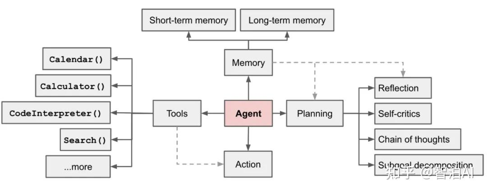

#### Token （tokens）
Token是大语言模型(LLM)处理自然语言的“最小单位”，可以理解为AI眼中的“字或词”，但并非完全对应人类语言的字词一比如“人工智能”可能被拆成1个Token，而“unbelievable”可能被拆成“un_”“believe”“-able”3个Token。
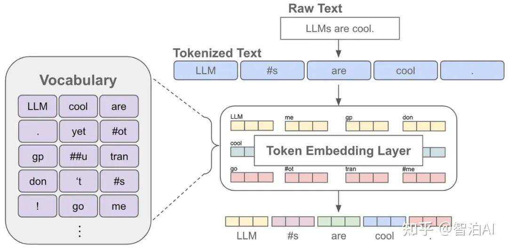

####  嵌入模型（Embedding Model）
嵌入模型的核心作用，是将文本、图片、音频等非结构化数据转化为一串能被计算机理解的“数值向量”(向量维度通常为几百到几千)，且向量的“距离”能反映数据的“语义相似度”--比如“猫”和“狗”的向量距离，会比“猫”和“汽车”更近。
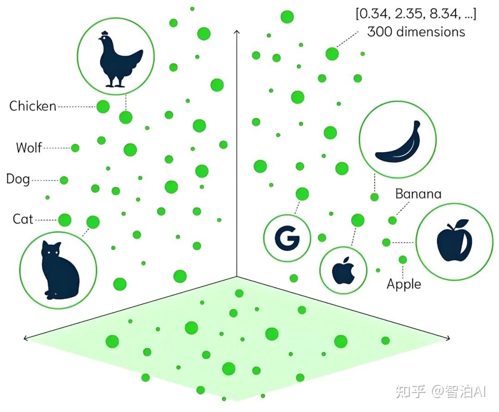

####  大模型幻觉（Hallucination）
大模型幻觉是指AI在生成内容时，自信地输出错误、虚构或不存在的信息(比如编造虚假的文献引用、错误的历史事件)，但它并非“故意说谎”，而是因为模型在训练中学习的是“语言概率分布”而非“事实真实性”--当遇到知识盲区时，会基于已有模式“合理推测”，最终导致输出偏离事实。
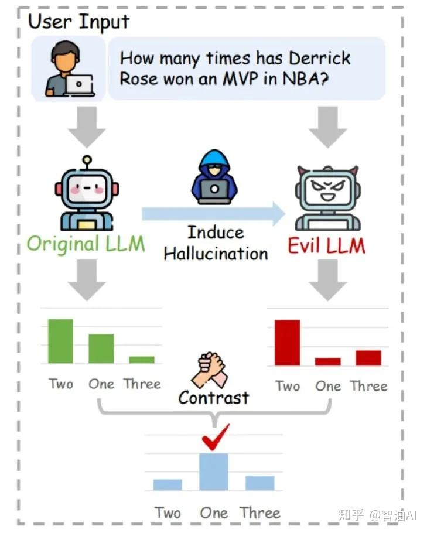

####  对齐（Alignment）
对齐的核心目标，是让AI系统的行为、目标与人类的价值观、需求保持一致--不仅要让A1“听懂指令”，还要“理解指令背后的真实意图”，避免出现“机械执行却偏离需求”的情况(比如用户说“帮我找一篇短一点的文章”，AI不会故意找一篇超长文章，也不会找内容无关的短文)。
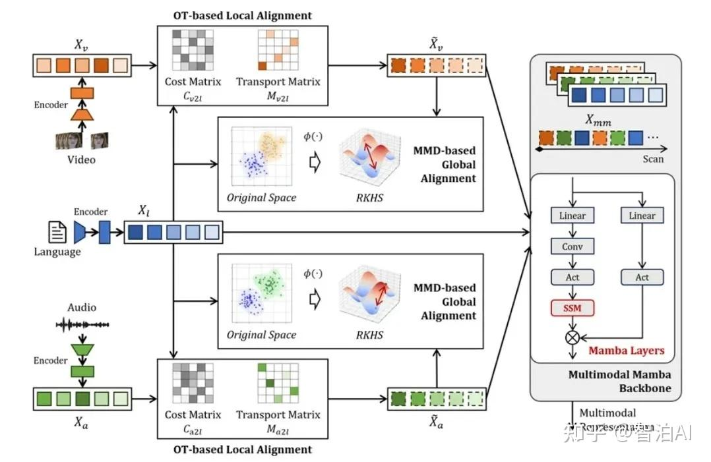

####  大模型（Large Model）
大模型本质是“参数规模超大的深度学习模型”，通常拥有数十亿到数万亿个参数(参数可类比为人类大脑中的“神经元连接”)(如全网文本、图片、代码)，具备理解、生成、通过学习海量数据推理等复杂能力。
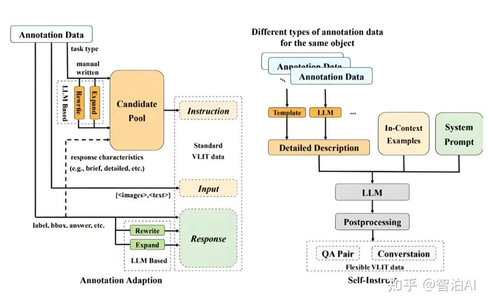

####  Transformer（转换器）
如果把AI模型比作“智能手机”，那么Transformer就是“芯片”——它不直接负责“拍照”“聊天”等具体功能，而是提供“高效处理信息”的核心能力，是目前主流大模型(如GPT系列、LLaMA系列)的基础架构。
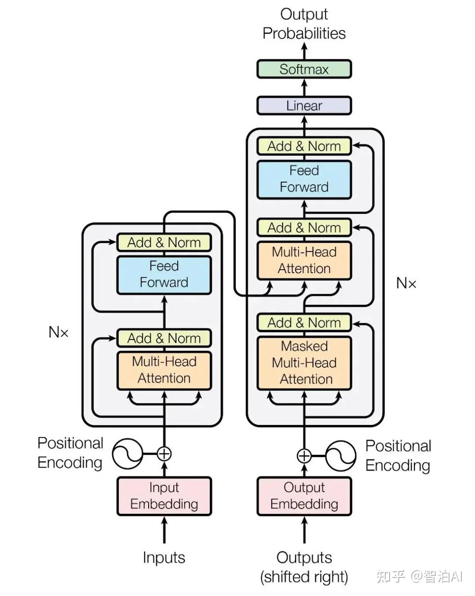

####  MOE（混合专家模型）
MOE(Mixture of Experts，混合专家模型)是一种“分而治之”的模型架构：它将大模型拆分为多个“子模型(专家)”’，每个专家专注处理某一类任务或数据(比如有的专家擅长“代码生成”，有的擅长“文本翻译”，有的擅长“逻辑推理”)，再通过一个“门控网络”，根据输入内容选择合适的专家组合来完成任务。
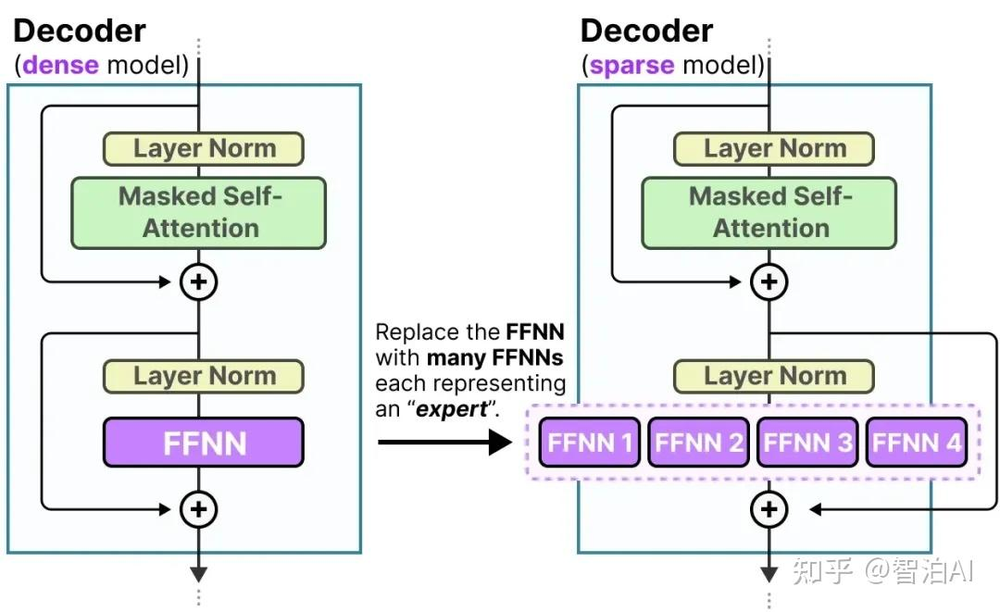

####   预训练(Pre-training)
预训练是大模型的“基础学习阶段”:在这个阶段，模型会在海量无标注数据(如全网公开的文本、书籍、代码)上进行训练，目标是学习“通用知识和语言规律”--就像学生在学校学习“语文、数学、英语”等基础学科，不针对某一特定职业，而是构建广博的知识基础。
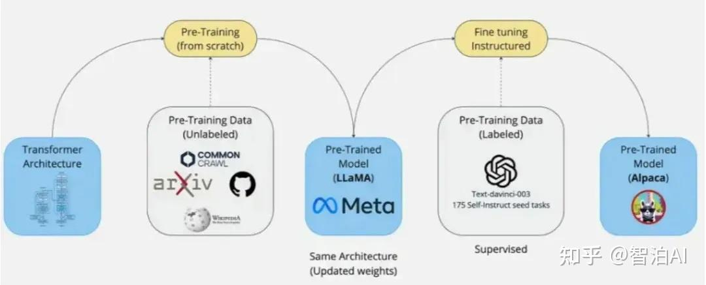

####   微调(Fine-tuning)
微调是在“预训练基础上的定向优化”: 通过给预训练模型输入“特定领域的有标注数据”(如医疗领域的病历、法律领域的法条)，让模型专注学习某一领域的知识和任务逻辑-一就像学生在大学选择“医学专业”，通过针对性学习成为医疗领域的专家。
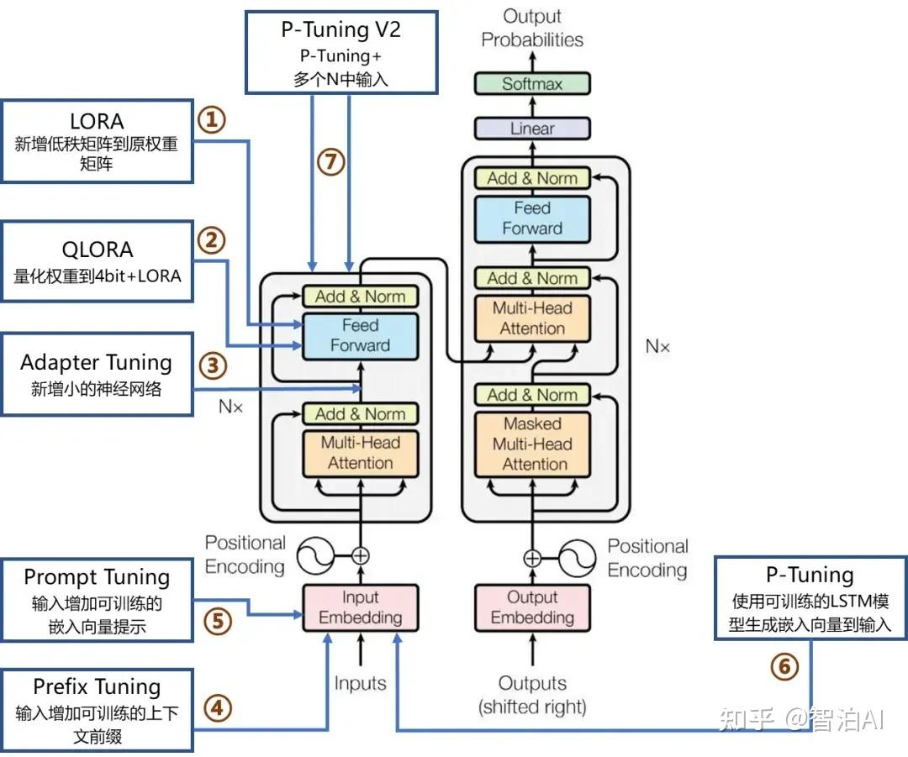

####   提示工程(Prompt Engineering)
提示工程是“通过优化输入给模型的'提示词’，让模型生成更符合需求的输出”的技术--简单来说，就是“用更精准的语言'指挥’AI干活”。

比如想让AI写一篇“手机测评文案”，若只说“写一篇手机测评”，输出可能杂乱无章;但如果提示“以'年轻人性价比之选’为主题，从性能、续航、外观三个维度写手机测评，每部分100字左右，语言活泼”，输出会更精准。
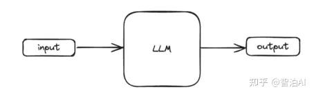

####   MCP(模型上下文协议)
MCP(ModelContextProtocol，模型上下文协议)是Anthropic在2024年11月推出的“开放标准”，核心作用是“统一大模型与外部工具、数据源的'通信语言’”。

在此之前，不同工具(如数据库、API、第三方服务)与大模型的交互方式各不相同，开发人员需要为每个工具单独写适配代码。

而MCP通过定义统一的“上下文格式”和“交互规则”，让大模型能像“用同一门语言和不同人对话一样，无缝对接数千种外部工具。
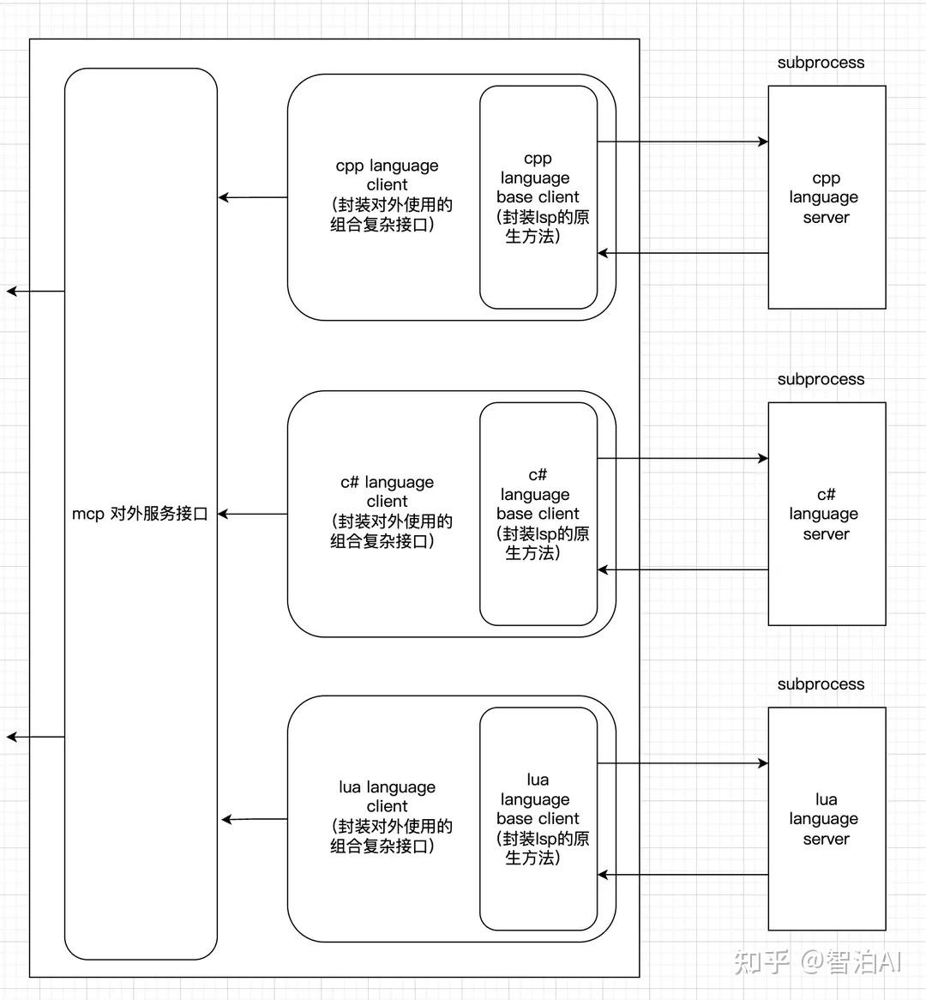

####   知识图谱(Knowledge Graph)
知识图谱是“用图形化方式表示实体、关系和属性的结构化知识库”--它不像传统数据库那样“机械存储数据”，而是将知识组织成“节点(实体，如'苹果’'乔布斯’)+边(关系，如'乔布斯创立了苹果’)”的网络，让计算机能清晰理解“事物之间的关联”
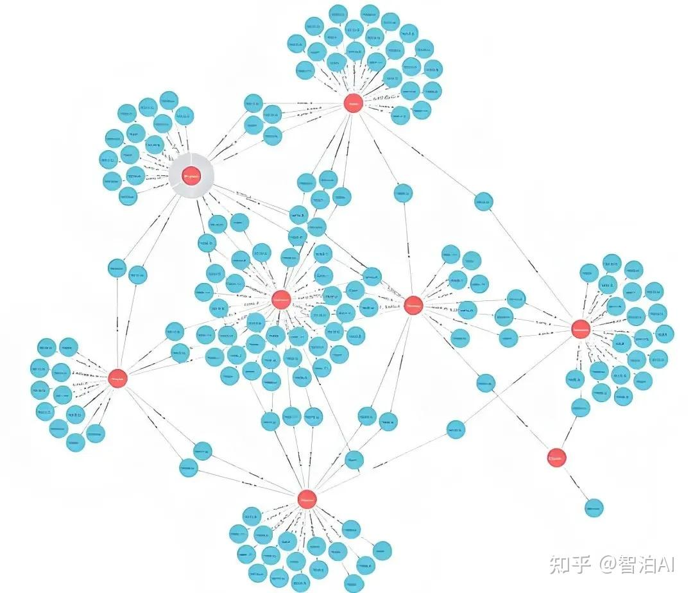


### 需求

实现“AI 搜索花卉并匹配 MySQL 数据库商品”的核心技术路径是 **向量搜索（Vector Search）**。

传统的搜索是靠“关键词”匹配（比如搜“玫瑰”），而 AI 搜索是靠“语义/特征”匹配（比如搜“红色的、代表爱情的花”，或者上传一张花卉图片）。

以下是实现这一功能的四个关键步骤：

------

### 1. 数据预处理：将花卉转化为“向量”

AI 无法直接对比 MySQL 中的文本或图片，必须先通过 **Embedding 模型**（如 OpenAI 的 `text-embedding-3` 或开源的 `CLIP` 模型）将花卉信息转化为一串数字（向量）。

- **操作：** 遍历你数据库中现有的花卉商品，提取它们的名称、描述，甚至图片。
- **转化：** 将这些信息输入 Embedding 模型，得到对应的特征向量（例如一个 512 维的数组）。

### 2. 数据库升级：存储向量

普通的 MySQL 版本不支持直接进行高效的向量运算。你有两种方案：

- **方案 A（推荐）：使用支持向量的 MySQL 扩展**
  - **MySQL 9.0+ / HeatWave：** 原生支持 `VECTOR` 数据类型。
  - **Cloud 服务：** 如阿里云 PolarDB、Google Cloud SQL 或 TiDB，它们都集成了向量搜索能力。
- **方案 B：外挂向量数据库**
  - 如果不想动现有数据库，可以引入专门的向量数据库（如 Milvus, Pinecone, 或 Chroma）。在 MySQL 里存商品基本信息，在向量库里存 `商品ID + 向量`。

### 3. 实现匹配逻辑（核心流程）

当用户输入搜索请求时，流程如下：

1. **用户输入：** 用户输入“适合送给母亲的粉色花”或上传照片。

2. **实时转换：** 使用**同一个** Embedding 模型，将用户的输入转化为一个“查询向量”。

3. **相似度计算：** 在数据库中使用 SQL 语句计算“查询向量”与“库存向量”之间的距离（常用 **Cosine Similarity 余弦相似度**）。

   SQL

   ```
   -- 示例 SQL (以支持向量扩展的 MySQL 为例)
   SELECT id, name, price 
   FROM flowers 
   ORDER BY VECTOR_DISTANCE(embedding_column, [用户查询的向量], 'COSINE') ASC 
   LIMIT 5;
   ```

4. **返回结果：** 数据库会返回最接近的 5 个商品。

### 4. 方案对比表

| **方案**                 | **优点**                   | **缺点**                     | **适用场景**         |
| ------------------------ | -------------------------- | ---------------------------- | -------------------- |
| **原生 MySQL (9.0+)**    | 架构简单，无需同步数据     | 需要升级数据库版本           | 数据量中等，追求稳定 |
| **云数据库 (PolarDB等)** | 性能强，开箱即用           | 有额外的云服务成本           | 企业级应用，快速上线 |
| **MySQL + Milvus**       | 极其适合海量数据（千万级） | 系统复杂度增加，需维护两个库 | 大规模电商平台       |

使用 TiDB Vector 搭建 RAG 应用 https://tidb.net/blog/7a8862d5

polardbx https://doc.polardbx.com/zh/quickstart/topics/quickstart.html#%E5%9C%A8-ubuntu-%E4%B8%8A%E5%87%86%E5%A4%87%E6%B5%8B%E8%AF%95%E7%8E%AF%E5%A2%83

需要配置三个模型：

**嵌入模型（Embedding Model）：**通过对文本的语义理解，将文字信息映射到向量空间中，使语义相似的文本在向量空间中的距离更近。例如，“如何预防感冒？” 和 “感冒的预防方法有哪些？” 会被转化为距离较近的向量，从而为后续的检索匹配提供基础。
**重排模型（Reranker Model）：**基于文本与问题的语义相关性、信息完整性、准确性等深层特征，重新调整候选文本的顺序，过滤噪音信息（如无关内容、低质量回答），确保更相关的文本被优先送入生成模型。例如，在检索 “机器学习算法” 时，重排模型会将详细讲解算法原理的文档排在泛泛而谈的内容之前。
**文本模型（生成模型，如 LLM）：**基于检索到的相关信息和用户问题，生成最终的回答。
RAG 通过嵌入模型将用户问题与知识库文本转化为语义向量并检索相关信息，经重排模型优化排序后，由文本模型结合检索结果生成准确且有依据的回答，实现 “检索增强生成” 的闭环。

这里我们发现，默认的嵌入模型和重排模型已经帮我们配置好了，这里应该是 “百智云” 给这个产品提供了赞助，默认提供了一些免费额度。不过嵌入模型和重排模型其实在整个 RAG 检索的过程中 Token 消耗量是非常小的，所以这里我们用默认的免费额度就可以用非常久了。

AI大模型基础概念扫盲篇：Agent、Token、MoE、RAG、Embedding、对齐、Transformer、预训练、微调 https://zhuanlan.zhihu.com/p/1977397410935358208


####  教程

Streamlit 极速搭建AI智能对话助手 https://www.bilibili.com/video/BV1w3ddYuETz/

秋芝2046 https://space.bilibili.com/385670211?spm_id_from=333.788.upinfo.detail.click

【隔壁的程序员老王】 原来写一个 AI Agent 这么简单 https://www.bilibili.com/video/BV1UMVKzEESL

AI时代下6大应用方向，分享给在寻找创业赚钱机会的人 https://www.bilibili.com/video/BV122cweVEbB

```
我想做一个ios app，是一个ai自动记账app。
这个app可以随意输入自然语言或者语音输入自己的消费，然后由gemini 2.5 pro模型的ai解析我的语音并且自动分类和帮我存储我的账单。
登录和数据存储都使用supabase。
语音功能则需要买会员，这个会员服务的购买使用stripe。
我希望页面漂亮炫酷，是黑客帝国风格的感觉。

##注意
你只需要完成项目的生成，而不需要执行测试和构建的工作
使用ios18.5,我会用iphone 16pro作为模拟器
gemini、supabase和stripe都已经配置好
除了要求的功能其他尽量保持简单。

用AI开发上线App全流程！全网最全新版TRAE教程 https://www.youtube.com/watch?v=1c5gc7admh8


Agent Skills | 菜鸟教程： https://www.runoob.com/claude-code/claude-agent-skills.html 
TRAE CN技能使用:  https://docs.trae.cn/ide/skills 
官方开源的skills：  https://github.com/anthropics/skills 
规范： https://agentskills.io/home 
Skills市场： https://skillsmp.com
```


对于 2026 年的小白学习者，AI 的核心概念已从传统的算法研究转向了“智能体（Agents）”和“多模态”的应用。除了机器学习的基础理论，你还需要掌握以下关键概念：

1. 三大底层支柱

- **算力 (Compute)**：AI 运行的物理基础，主要指 GPU（显卡）和 TPU（张量处理单元）。
- **算法 (Algorithm)**：AI 处理信息的一系列指令和规则，决定了模型如何学习。
- **数据 (Data)**：AI 的“燃料”。2026 年的学习重点在于**数据质量**而非仅仅是数量。 
- 生成式 AI (GenAI) 核心术语

- **大语言模型 (LLM)**：如 GPT、Claude 等，是在海量文本上训练的智能核心。
- **Transformer 架构**：目前绝大多数大模型的“底座”，你需要理解它如何通过“注意力机制”处理信息。
- **多模态 (Multimodal)**：指 AI 能同时处理文字、图像、音频、视频等多种形式的信息。
- **长上下文窗口 (Long Context Window)**：指模型一次能“读”多少内容。2026 年的模型已能同时处理数百万字或数小时的视频。 
- 应用与工程概念（当前最实用）

- **RAG (检索增强生成)**：让 AI 联网或读取你的私人文档来回答问题，解决模型“胡说八道”的关键技术。
- **AI 智能体 (AI Agents)**：2026 年的热点。AI 不再只是聊天，而是能自主拆解任务、调用外部工具（如发邮件、写代码、订机票）的系统。
- **提示工程 (Prompt Engineering)**：与 AI 沟通的艺术，通过精准的指令引导 AI 输出更高质量的结果。
- **微调 (Fine-tuning)**：在通用模型的基础上，使用特定行业数据进行“小规模训练”，使其成为领域专家。 
- 2026 年新兴前沿概念

- **世界模型 (World Models)**：AI 开始理解物理规律（如重力、碰撞），而不仅仅是预测下一个词，这是 AI 迈入物理世界的关键。
- **具身智能 (Embodied AI)**：将 AI 植入机器人躯体，使其能在真实环境中稳定工作并持续学习。
- **推理能力 (Reasoning)**：如 OpenAI 的 o1 系列，模型会在输出前进行“思考”和“自我校对”，而不仅是凭直觉反应。 
- 评价与伦理

- **幻觉 (Hallucination)**：AI一本正经地胡说八道。
- **对齐 (Alignment)**：确保 AI 的行为符合人类价值观和法律规范。 

**学习建议**：
小白不需要精通数学推导，但一定要理解这些概念的**逻辑连接**。建议从 [Hugging Face](https://hugging face.co) 的开源生态开始了解这些概念是如何落地的。 