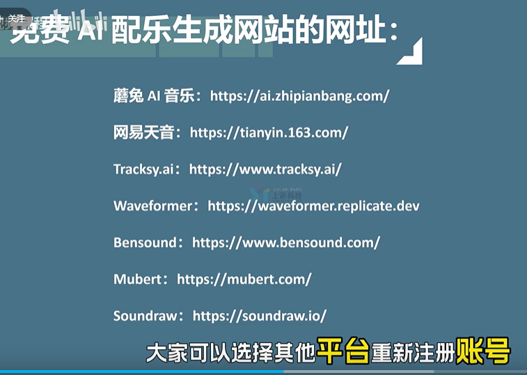

### 统一技术栈

后端: laravel

前端: vue react flutter electron

后台框架: antd

#### 2025.12.10
am ant登录 token 获取当前用户功能开发

18:12 学习es6 [babel]

19:37 看minimax访谈

#### 2025.12.11
am 看tim访谈

pm 学习es6 let 字符串扩展 对象解构赋值 数组扩展

#### 2025.12.12
am 10:00 看 **影视飓风** - AI可以取代我，那我的意义是？

感悟 
**无限进步，热爱至上**
**“愿此行终抵群星”是一句表达追求理想与目标的决心的格言，源自游戏《崩坏：星穹铁道》，并与拉丁语格言“Per** **aspera** **ad** **astra”相关联。
Per Aspera Ad Astra循此苦旅，以达天际**

pm 23:46 学习完es6知识点 

#### 2025.12.13
休息一天

#### 2025.12.14
12:23 沟通女生吃饭时间

14:23 看一席 孩子，你怎么了 https://yixi.tv/#/speech/detail?id=1382

15:14 农民工，何以为家 https://yixi.tv/#/speech/detail?id=1381

15:50 嚯！AGI真来了？https://yixi.tv/#/speech/detail?id=1337  

学ant Chart Form

#### 2025.12.15
12:30  去万达买礼物

pm 学习 es6 symbol generator map 

#### 2025.12.16
ant基础复习 https://www.bilibili.com/video/BV1yH4y1T7NW

Agent 的概念、原理与构建模式  https://www.youtube.com/watch?v=GE0pFiFJTKo

#### 2025.12.17
屯溪出差

#### 2025.12.18
手机换电池

react-todolist

react-实战基础部署

#### 2025.12.19
学习ai概念基础

antd 后台 - 添加文章列表

#### 2025.12.20
antd 后台 - 修改文章

antd 后台 - 添加用户列表

#### 2025.12.21
火车来信阳

#### 2025.12.22
信阳出差

#### 2025.12.23
信阳出差

#### 2025.12.24
休息

#### 2025.12.25
休息

#### 2025.12.26
Trae 保姆教程

https://www.bilibili.com/video/BV1LFa2zQEjU/

https://www.bilibili.com/video/BV1PwBuBtEZo

#### 2025.12.27
新华看电池问题

调试flutter 环境

晚上打篮球锻炼

##### 2025.12.28
步行街吃饭

#### 2025.12.29
vue学习

#### 2025.12.30
uniapp + nest 小案例

#### 2025.12.31
京东超市

地锅鸡聚餐


视频号宠物吃播赛道 https://www.bilibili.com/video/BV1gQiuBKEgH/

-------------------------------------------------------------------------------------------------------------------------------------------------------------------------------------------

#### 2026.1.1
给隔壁栋阿姨看电池型号

放假休息

LOL

#### 2026.1.2
给隔壁栋阿姨确认电池型号

人人可做的抖音童装Ai图文赛道 https://www.bilibili.com/video/BV1EPmbBFEe4/

放假休息

LOL

#### 2026.1.3
放假休息

兑换树袋熊电竞红包

看 请回答1988 解说

11点多打篮球

#### 2026.1.4
Qoder Nextjs Demo

如何使用 codebuddy 从 0 到 1 完成一个产品，全流程录制，保姆级教学。 https://www.bilibili.com/video/BV1PKBiBzERa/

用trae+uniapp开发一个扫码点餐小程序？30分钟超高质量教学 https://www.bilibili.com/video/BV1BmyWBCE2j/

【教程】不写一行代码，开发B站热门选题AI助手 | 数据分析 | 爬虫 https://www.bilibili.com/video/BV1JBmKBBEZa/

电影最TOP：年终盘点来喽！2025年度十大佳片 https://www.bilibili.com/video/BV1kovSBcE3s/

#### 2026.1.5
飞书有哪些功能 https://www.bilibili.com/video/BV15L411b7ac/?spm_id_from=333.1391.0.0

副业怎么挣钱 红果短剧 https://www.bilibili.com/video/BV1Zts6zXEGF/?spm_id_from=333.1391.0.0

在线文本朗读 https://textreader.cc/

文本转语音 https://www.text-to-speech.cn/

研究个体户申报 【未提交】

#### 2026.1.6 
【Coze工作流教程】一键生成Sora2/即梦，镜前自拍服装展示电商产品短视频，保姆级实操演示 https://www.bilibili.com/video/BV1yjqeBFEeM/

王炸Banana2电商工作流！一键换装生成《走秀短视频》 https://www.bilibili.com/video/BV1pRBPB1EkZ/

【2026最新版】全30集，即梦+豆包+剪映，2小时快速掌握AI视频制作技巧 https://www.bilibili.com/video/BV1qABABaEjx

善待自己是一剂药方（不保证有效）https://yixi.tv/#/speech/detail?id=1387

消化生活，点石成金 https://yixi.tv/#/speech/detail?id=1385



#### 2026.1.7
研究手机安装youtube tiktok app安装

figma ai 做绣妈妈 https://www.figma.com/make/Ubk0ahCL7SLOEngxujq4D5/Cross-Stitch-Trading-App?t=CUEHdARpDSVO7uIh-0

#### 2026.1.8
看  中国奇谭 解读

nocode 绣友圈 https://nocode.host/bs4v6v_aab909c 

#### 2026.1.9
Google账号最新注册教程 https://www.youtube.com/watch?v=AbVwUSYWcVA&t=267s 

企业宣传网页 https://dapper-looks-website.nocode.host/

#### 2026.1.10
AnyGen AI  https://www.anygen.io

附近找货 https://www.anygen.io/share/4vOYiGxaA6YdqUYoc76HhL

AI大模型应用开发学习路线规划来了 https://www.bilibili.com/video/BV1LRiLBtEv2/

2025吃透AI大模型全套教程（LLM+RAG+LangChain+Agent https://www.bilibili.com/video/BV1ikEEzGES5

#### 2026.1.11
研究外贸卖货 


【AI动画短剧】制作全流程！剧本+分镜+静帧+视频+配音+剪辑 https://www.bilibili.com/video/BV1VVqhBvECY/

拓竹 3d打印 https://www.bilibili.com/video/BV1azBKBeEhp/?spm_id_from=333.1391.0.0

21：00 - 1：00 LOL

#### 2026.1.12
Genshin-TS（gsts）是一套使用Typescript进行千星奇域项目开发的工具链  https://github.com/josStorer/genshin-ts

飞牛系列-在线fpk快速打包飞牛应用 https://www.bilibili.com/video/BV1676DB5ESD/

飞牛fpk安装包脚手架fnpack可视化UI包 https://github.com/snltty/fnpackup

AI视频不再靠抽卡！镜头可控完整教学  https://www.bilibili.com/video/BV1giqEBwEeG/

年度好用AI大赏！【小白必备】 https://www.bilibili.com/video/BV1ibvhBqEmp

中国AI产业冰山图 https://www.bilibili.com/video/BV1gKiEBZEHq/

你管这破玩意叫智能体？https://www.bilibili.com/video/BV1PRvhBSEwx

#### 2026.1.13
如何把卡片设计的更高级？https://www.bilibili.com/video/BV1UMrPBZEDp/

ComfyUI提示词懒人工具  https://www.bilibili.com/video/BV1ahBeBCEXH

```
【工具】https://pan.quark.cn/s/e5cfb76b92fc
【插件】https://pan.quark.cn/s/9c06d219c095
【工作流】https://pan.quark.cn/s/ed9cb1d9bdec
【模型】【diffusion_models】https://pan.quark.cn/s/ff6b277713da
【模型】【clip】https://pan.quark.cn/s/c7dddf6e1754
【模型】【vae】https://pan.quark.cn/s/9143bfa61170
```

原来写一个 AI Agent 这么简单 https://www.bilibili.com/video/BV1UMVKzEESL

AI时代下6大应用方向，分享给在寻找创业赚钱机会的人 https://www.bilibili.com/video/BV122cweVEbB

看《her》电影 https://m.yichengwlkj.com/pc/drama/55989

#### 2026.1.14
新手也能上手的AI终端开发模式 - AI测试驱动开发(AI + TDD) https://www.bilibili.com/video/BV13MpCzjEa3/

Blender开挂啦❗️新手建模直接躺赢❗️https://www.bilibili.com/video/BV14frhBBECj/?spm_id_from=333.1391.0.0

Blender教程丨Hyper3D.AI建模快速体验流程 https://www.bilibili.com/video/BV1JcygBBEam/

《海市蜃楼》https://www.bilibili.com/video/BV1WcvsBaEoi

用AI开发上线App全流程！全网最全新版TRAE教程 https://www.youtube.com/watch?v=1c5gc7admh8

我们是如何学习的？https://sspai.com/post/105224

#### 2026.1.15
干货教程：AI手办如何拆件？ https://www.bilibili.com/video/BV1u9qmBGEty/

AI小智 https://xiaozhi.me/

FreeRTOS https://www.freertos.org/zh-cn-cmn-s/Why-FreeRTOS

RAG企业实战：从原理到落地，构建企业智能知识库 https://www.woshipm.com/ai/6323870.html

#### 2026.1.16
vector embeddings

向量数据库 https://www.youtube.com/watch?v=XZ75Ky-E_HM 【视频详细演示了如何在 MySQL 环境中生成 Embedding 向量、存储并在应用层实现相似度搜索的完整流程。】

sqlbot https://www.bilibili.com/video/BV1SBtizgED4/

宝哥请吃饭

LOL

#### 2026.1.17
AI 编程工具都在用 Agent Skills https://www.bilibili.com/video/BV1tRr6BAErJ/

年赚75万？20万粉丝B站博主背后的故事...... https://www.bilibili.com/video/BV1BHkKBDE1q/

LOL


#### 2026.1.18
休息

看剧

#### 2026.1.19
搞个税

ai做狸小电网站

研究国外号码注册  https://esimplus.me/

#### 2026.1.20
Agent Skill 从使用到原理，一次讲清 https://www.bilibili.com/video/BV1cGigBQE6n

明年经济会好吗？2026中国宏观经济展望 

#### 2026.1.21
去天鹅湖万达

AI大模型基础概念扫盲篇：Agent、Token、MoE、RAG、Embedding、对齐、Transformer、预训练、微调 https://zhuanlan.zhihu.com/p/1977397410935358208

Google Colab https://colab.research.google.com/

Dify https://dify.ai/zh

Browse AI https://www.browse.ai/

#### 2026.1.22
灵活与效率的平衡 | HeroUI快速上手 https://www.bilibili.com/video/BV1nMz7BEEyV/

nizima LIVE  https://nizimalive.com/en/

针对您关注的这两个细分群体，2026年的AI技术已经进化到可以实现“多模态交互”与“超长记忆”的深度融合。以下是为您梳理的产品设计方案：

一、 针对老年人的陪伴硬件：AI “暖科技” 守护者
老年人的需求核心在于：安全感、被需要感、极简操作。

二、 针对年轻人的虚拟恋人软件：数字孪生灵魂伴侣
年轻人的需求核心在于：个性化审美、极端包容、沉浸式互动、社交货币。

| **维度**     | **老年硬件 (Warm-Tech)**    | **年轻人App (Cyber-Soul)**    |
| ------------ | --------------------------- | ----------------------------- |
| **首要任务** | 消除孤独感 & 安全监护       | 提供情绪价值 & 幻想补偿       |
| **技术重心** | 语音识别精度 & 姿态检测算法 | 多模态记忆生成 & 实时语音合成 |
| **交互频率** | 低频、长时、生活化          | 高频、碎片、戏剧化            |
| **设计禁忌** | 复杂操作、生冷机械声        | 回复死板、记忆重置            |

#### 2026.1.23
微雪 ESP32-S3 7.3寸全彩墨水屏相框 ，可AI语音交互+文生图多功能相册  https://www.bilibili.com/video/BV1Tfk5BtEtr/

微雪电子  https://www.waveshare.net/

千元级开源AI机械臂原理解析 https://www.bilibili.com/video/BV1A2MyzuEfr

通过 Chat SDK 搭建网页在线客服 https://docs.coze.cn/tutorial/chat_sdk_web_online_customer_service

#### 2026.1.24
休息

跟老弟聊上次见面妹子的问题

跟鑫哥沟通再次跟妹子见面的事情

#### 2026.1.25
休息

给老吴搬家

#### 2026.1.26
我封装了剪映剪辑skill，AI全自动接管剪映完成剪辑！ https://www.bilibili.com/video/BV1hLzCBzEDS/ 

调教Trae CN 根据 接口文档 生成 后台管理系统 

#### 2026.1.27
【老戴】我用 AI 分析了500G照片库，做了一个“会自己选图”的电子相框 https://www.bilibili.com/video/BV1KczbBXEeC/ 【https://github.com/dai-hongtao/InkTime 】

#### 2026.1.28
Clawdbot 
https://clawd.bot/ https://github.com/clawdbot/clawdbot【官网】  

https://docs.molt.bot/start/getting-started 【教程】  

https://blog.csdn.net/hzm8341/article/details/157433960

https://zhuanlan.zhihu.com/p/1999524848402179955 

https://github.com/xianyu110/clawbot

https://clawdhub.com/skills 【clawdhub】 

```
启动命令
clawdbot gateway --verbose
```

#### 2026.1.29
别让AI再当好人了，干活干活给我去干活！ https://www.bilibili.com/video/BV1QEkuBJESc/

科幻照进现实，人类如何自处 https://yixi.tv/#/speech/detail?id=1392

三代母亲的养育故事 https://yixi.tv/#/speech/detail?id=1396

追风 https://yixi.tv/#/speech/detail?id=1386

#### 2026.1.30
误闯天家，深入解析国务院研究部长万字长文《AI、就业和社保》https://www.bilibili.com/video/BV14hzsB2EBW/

聊一下AI时代怎么选取信息源 https://www.bilibili.com/video/BV1xr6GB5EnH/

上个月b站收入7000元，聊聊做up主 https://www.bilibili.com/video/BV1QG411f7Vn/

出海做数字产品，从0到第一笔美金睡后收入（实操分享） https://www.bilibili.com/video/BV1ArkeBrEXx/

Markdown Formatter - VS Code 插件  https://gitee.com/xbdsky/budingadmin/tree/master/vscode/markdown-formatter

2026年的机会在哪儿  https://www.bilibili.com/video/BV15Di1BkEGa/ 

一人公司 OPC：AI 时代可以如何生存？ https://www.bilibili.com/video/BV1VSkjBGEoN/

#### 2026.1.31
普通人赚钱，不能靠风口 https://www.bilibili.com/video/BV1J5z7B5EFV/

#### 2026.2.1
人形机器人2026大洗牌：谁将裸泳，谁将吃肉？| 产业链深度拆解 https://www.bilibili.com/video/BV1u2zWB2E3s/

【基德】人形机器人为什么注定失败？ https://www.bilibili.com/video/BV1gNsHzdEcR/

#### 2026.2.2
Transformer是什么？https://www.bilibili.com/video/BV1G4iMBeEWH

45分钟吃透Skills原理  https://www.bilibili.com/video/BV1QN6FBnERf/


